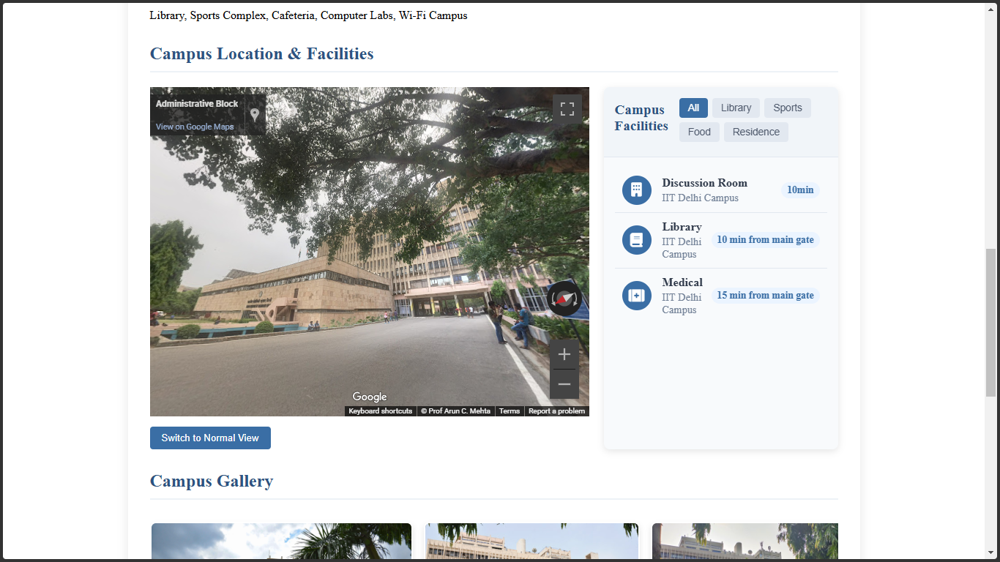

# College Search Platform


A comprehensive platform facilitating college discovery, application, and management for students and educational institutions.


## Overview

The College Search Platform facilitates the college selection process by offering a user-friendly interface to search, explore, and interact with educational institutions. The platform serves multiple user roles including students, college administrators, and platform administrators.

### Homepage

*College search homepage with featured institutions*

<br>


### Popular Colleges

*Showcasing top-rated educational institutions*

<br>

## Features

### For Students
- **Advanced College Search**: Find colleges by name, location, and other criteria
- **Detailed College Profiles**: View comprehensive information about each institution
- **Course Catalogs**: Browse available courses, degree programs, and fees
- **Interactive Campus Maps**: Explore campus locations with Google Maps integration
- **Rating & Review System**: Rate colleges and share experiences
- **Direct Application**: Submit applications to colleges of interest
- **Responsive Design**: Seamless experience across desktop and mobile devices

### For College Administrators
- **College Profile Management**: Update college details, courses, and facilities
- **Event Management**: Create and manage upcoming campus events
- **Application Processing**: Receive and respond to student applications
- **Facilities Showcase**: Highlight campus amenities and facilities
- **Review Moderation**: Manage student reviews

### For Super Administrators
- **Platform Management**: Oversee the entire system
- **College Administrator Management**: Create and manage college admin accounts
- **User Management**: Monitor registered users

## Technology Stack

- **Frontend**: HTML5, CSS3, JavaScript
- **Backend**: Node.js (Express)
- **Database**: MySQL
- **Maps Integration**: Google Maps API

## Installation

### Prerequisites
- **Node.js** (v12 or higher)
- **MySQL Server** (v8.0 or higher)
- **MySQL Workbench** (for database management)
- **Modern web browser** (Chrome, Firefox, Edge, Safari)

### Steps

1. **Clone the repository**
   ```bash
   git clone https://github.com/Banshal-Yadav/FindCollege.git
   cd FindCollege
   ```

2. **Install dependencies**
   ```bash
   npm install
   ```

3. **Configure Environment Variables**
   - Create a `.env` file in the project root
   - You can use the provided `.env.example` as a template
   - Update the file with your MySQL credentials:
   
   ```
   DB_HOST=localhost
   DB_USER=yourusername
   DB_PASSWORD=yourpassword
   DB_NAME=collegedb
   DB_PORT=3306
   ```
   
   > **Note:** The `.env` file is listed in `.gitignore` to keep your sensitive data private.

4. **Set up the database**
   - Create a database with the name specified in your `.env` file (e.g., `collegedb`)
   - Import the SQL dump using MySQL Workbench:
     1. Open MySQL Workbench and connect to your server
     2. Go to Server > Data Import
     3. Select "Import from Self-Contained File" and choose `collegedb.sql`
     4. Choose the target schema (or create a new one) and click Start Import
   
   - Or using the command line:
     ```bash
     mysql -u root -p collegedb < collegedb.sql
     ```

5. **Start the application**
   ```bash
   npm start
   ```

6. **Access the application**
   - Open your browser and navigate to `http://localhost:3000`

   <br>

## Usage

### Student Portal
1. **Search**: Use the search bar on the homepage to find colleges
2. **Details**: Click on a college to view detailed information including courses, facilities, events, and reviews
3. **Account**: Register for an account to submit applications and reviews
4. **Feedback**: Rate and review colleges based on your experience

<br>

### College Details

*Detailed view of an individual college*

<br>


*Additional college information and application options*

<br>
<hr>

### Admin Portal
1. **Login**: Access the admin dashboard at `/admin/login.html`
2. **Manage**: Log in using your administrator credentials to manage college profiles, courses, events, and facilities
3. **Process**: Handle student applications from the dashboard

### Admin Dashboard

*Management interface for college administrators*

<br>


*Extended administrative capabilities for managing college data*

<br>
<br>

## Project Structure

```
/
├── public/                  # Static files
│   ├── admin/               # Admin portal files
│   ├── style.css            # Main stylesheet
│   ├── index.html           # Homepage
│   ├── login.html           # User login
│   ├── register.html        # User register
│   └── college-detail.html  # College details page
|
├── screenshots/
|   ├── admin_dash_board.png
|   ├── college_details.png
|   ├── homepage.png
|   ├── more_college_details.png
|   ├── more_admin_dashboard.png
|   └──popular_colleges.png
|   
├── server.js                # Node.js server
├── package.json             # Project dependencies and scripts
├── .env.example             # Example environment variables file
├── collegedb.sql            # SQL dump file for the database
└── README.md                # Project README file
```

<br>

<br>

## Contributing

Contributions are welcome! Follow these steps to contribute:

1. Fork the repository
2. Create your feature branch (`git checkout -b feature/amazing-feature`)
3. Commit your changes (`git commit -m 'Add some amazing feature'`)
4. Push to the branch (`git push origin feature/amazing-feature`)
5. Open a Pull Request with a detailed description of your changes

## License

This project is licensed under the MIT License - see the [LICENSE](LICENSE) file for details.

## Contact

Project Link: [https://github.com/Banshal-Yadav/FindCollege](https://github.com/Banshal-Yadav/FindCollege)

---

Made for students and educational institutions